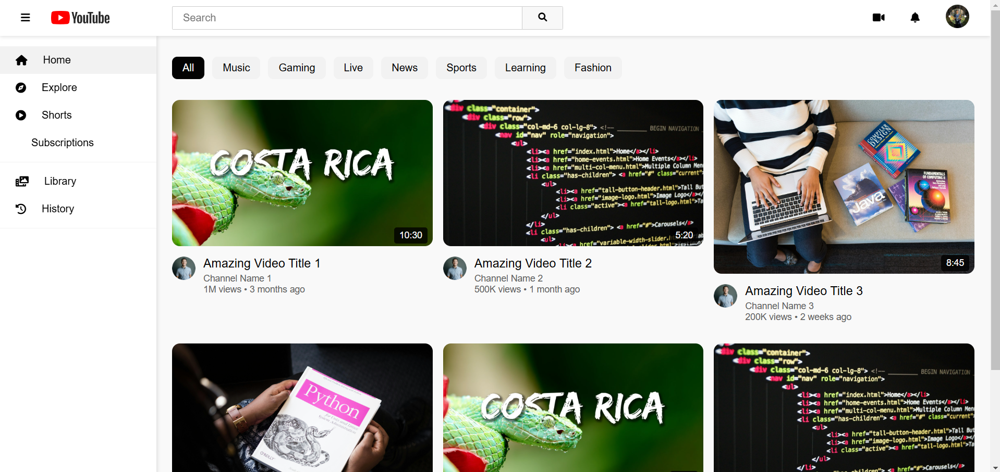

# YouTube Clone

A simple YouTube clone built with HTML, CSS, and JavaScript. This project replicates the look and feel of YouTube's interface, providing basic functionalities such as video listing, search, and category filtering.

## Features

- **Responsive Design:** Adapts to different screen sizes.
- **Video Cards:** Dynamically generated video cards displaying thumbnails, titles, and channel information.
- **Search Functionality:** Search videos by title.
- **Category Filter:** Filter videos based on selected categories.
- **Collapsible Sidebar:** Toggle the sidebar for a more compact view.

## Technologies Used

- HTML
- CSS
- JavaScript
- Font Awesome for icons

## Screenshots

 <!-- Replace with an actual screenshot path -->

## Getting Started

### Prerequisites

- A web browser (Chrome, Firefox, etc.)

### Installation

1. Clone the repository:
   ```bash
   git clone https://github.com/SokandeSujal/YouTube-Clone.git
   ```
2. Navigate to the project directory:
   ```bash
   cd youtube-clone
   ```
3. Open `index.html` in your browser to view the project.

## File Structure

```
/youtube-clone
├── images
│   ├── Avatar.png
│   ├── youtube-logo.png
│   ├── thumbnail.jpg
│   ├── thumbnail2.jpg
│   ├── thumbnail3.jpg
│   └── thumbnail4.jpg
├── index.html
├── styles.css
└── script.js
```

## Usage

- Click on video cards to view video details.
- Use the search bar to find specific videos.
- Select categories to filter videos accordingly.

## Contributing

1. Fork the repository.
2. Create a new branch:
   ```bash
   git checkout -b feature/YourFeature
   ```
3. Commit your changes:
   ```bash
   git commit -m "Add some feature"
   ```
4. Push to the branch:
   ```bash
   git push origin feature/YourFeature
   ```
5. Create a pull request.

## License

This project is licensed under the MIT License - see the [LICENSE](LICENSE) file for details.

## Acknowledgments

- Inspired by the original YouTube interface.
- Special thanks to [Font Awesome](https://fontawesome.com/) for providing icons.
```
